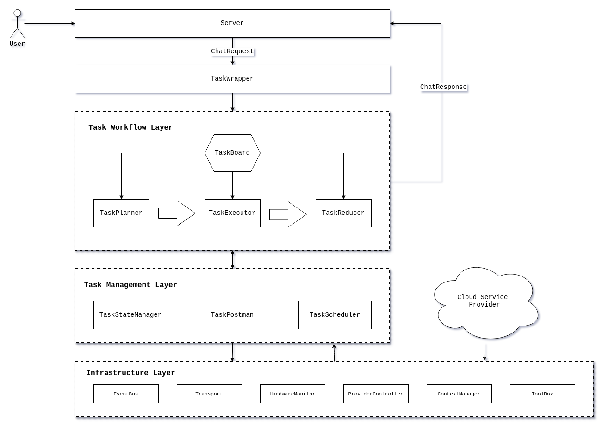

# Lucinda

**Lucinda** is a distributed AI-Operating System purpose-built for the edge.

Unlike traditional operating systems that manage CPU/RAM for processes, or Kubernetes which orchestrates containerized microservices, Lucinda is designed to manage **Inference Capabilities** and **Conversation Contexts** across a decentralized network of consumer-grade hardware (phones, PCs, and local servers).

## Core Philosophy

+ **Context Stability**: Maintaining seamless LLM conversation state across devices.
+ **Intelligent Task Routing**: Effectively dispatching user requests based on real-time hardware rather than static configurations.
+ **Resource Democratization**: Turning idle "dark compute" on home device into a unified, private AI cluster.
+ **Modular Service**: Enabling developers or cloud service provider to provice safe and sharable services and resources.

## Architecture && Components

> Need to update

### Server

Different servers for different apis facing users, it receives `ChatRequest` and sends `ChatResponse` back.

### Monitor

Trace **nodes' status**, **providers’ status** and **tasks’ status** providing information for those modules need to make decisions, including *RouterController*, *Scheduler* and *ContextManager*.

### TaskController

`TaskController` manages **task wrapping**, **task dividing**, **task routing** and **task reducing**, it receives `ChatRequest` and returns `ChatResponse` to *Server* 

+ **TaskWrapper**: wrap `ChatRequest` into `Task` , labeling this task.
+ **TaskDivider**: divide `Task` into `SubTask`, then build an `TaskPlan`
+ **TaskBoard**: load `TaskPlan` into board, inform *Provider* of `TaskPlan` , waiting for requests
  
+ **TaskAssigner**: assgin `SubTask` to *Provider* requested
  
+ **TaskReducer**: Reduce `Result` to a full `ChatResponse`, then send back to *Server*

### TaskExecutor

+ **Scheduler**: receive `SubTask` and **rank** according to **urgency** and **forcasted time**.
+ **Executor**: Generate `Result` back to Boss Node. 

### Transport

This layer deals with basic connections between nodes.

+ **Transporter**: manage **internel node connection** and **raw `NodeMessage` sending**.

+ **Trigger**: transform incoming `NodeMessage` to proper internel `Action` .

### Provider

`Provider` is the interface for agents.

### Toolbox

**Toolbox** provides some safe but additional operations for *Provider*. 

### ContextManager

**ContextManager** manages context for *Provider*. 
