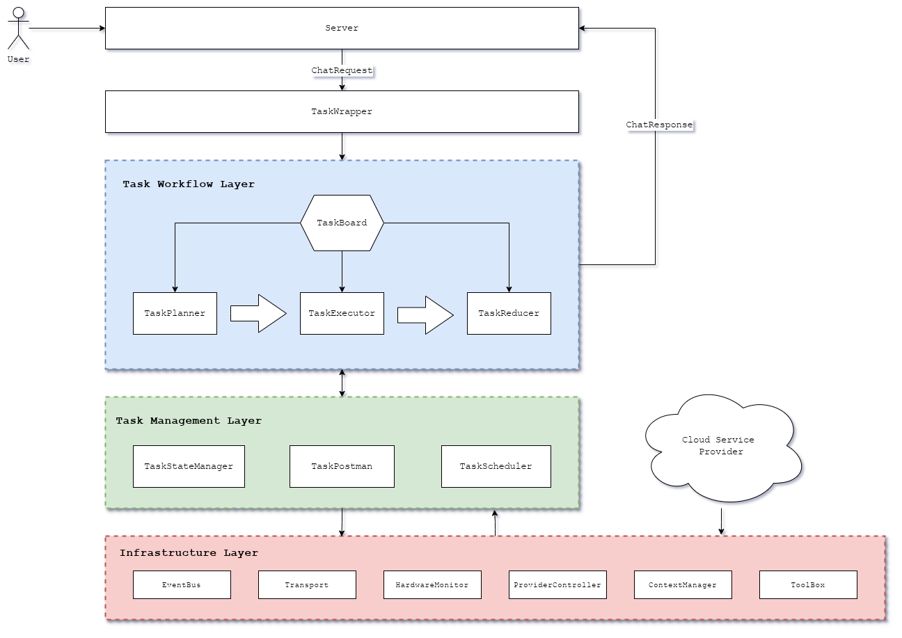

# Lucinda: A Computing-Power Aware Orchestration Framework for Distributed AI Agents

## Abstract

Existing LLM agent frameworks excel at macro-logic routing but fail to perceive the status of **underlying heterogeneous hardware** (e.g., edge-deployed Ollama vs. cloud APIs). This missing layer leads to severe **resource starvation or task blocking** in edge environments. This work presents **Lucinda**, a compute-aware distributed agent orchestrator that bridges this gap. By decoupling agent behaviors into a fine-grained **"Plan-Execute-Reduce"** pipeline, Lucinda dynamically schedules sub-tasks based on an **event-driven paradigm** and **real-time hardware telemetry**. In addition, a custom **TaskBoard with a publish-lease protocol** is introduced to prevent task contention and secure network stability, establishing an efficient, resource-optimized runtime for edge-cloud collaborative agents.

## 1. Introdcution

The rapid advancement of Artificial Intelligence (AI) agents has seamlessly integrated them into mainstream productivity workflows, serving as indispensable tools for daily oeprations. Currently, a vast majority of users choose for cloud-based deployment. This trend is driven by sort of reasons, but mainly two: first, cloud service providers offer turnkey, plug-and-play accessibility, which seems attractive for primary users; second, standard localized hardware typically fails to provision the stable, minimum required compute and memory resources to sustain heavy localized model initialization.

However, while convenient, this absolute reliance on centralized cloud models induces servere and unignorable drawbacks:

+ **User Privacy Vulnerabilities**: Sensitive individual prompts, contexts or corporate datasets are continuously exposed to third-party infrastructure during transmission,  magnifying data risks.
+ **Degraded Real-Time Responsiveness**: Constant cloud round-trips introduce high network demands and  unignorable latency, bottlenecking interactive application efficiency.
+ **Low Customization Freedom**: Centrialized APIs restrict users to rigid, immutable configurations, preventing fine-grained parameter tuning or local context adaption.

To resolve these limitations, shifting agent intelligence toward the edge is highly desirable, yet existing software infrastructures exhibit a severe architectural disconnect.

+ **Pure Application-Layer Framework** (e.g., LangChain, AutoGen) : Focus heavily on macro abstraction routing logic while remaining completely blind to the underlying physical substrate. When deployed on constrained edge  networks, they blindly spawn tasks and trigger blocking waits without assessing actual CPU or vRAM consumption.
+ **Local Inference Engines** (e.g., Ollama, vLLM) : Primarily act as static, single-node endpoint servers. They lack macro distributed task state management, lifecycle tracking, and collaborative scheduling capabilities across peer nodes.

Lucinda is specially designed to eliminate this gap. It serves as generalized, resource-aware task orchestration runtime platform optimized to empoweer future resource-efficient, highly capable localized agents within a collaborative network.

## 2. System Design

The basic workflow of Lucinda initiateds when a device intercepts a user ChatRequest, which the gateway immediately encapsulates into a structured Task object via the TaskWrapper. Instead of being confined to a standalone machine, the execution topology is distributed asynchronously across the edge-cloud network mesh. By utilizing a shared TaskBoard, single-node decoupling is accomplished, effectively recruiting the computational power of the entire local neighbourhood into the task procssing pool. Following the execution of the “Plan-Execute-Reduce” pipeline, the final aggregated artifact is streamed back to the user to complete the operational cycle.

The architecture of Lucinda is strictly separated into four highly cohesive layers combined with specialized dynamic mechanisms:

### A. Four-Layer Architectural Blueprint

+ **Server and TaskWrapper Layer** : Functions as the network ingress, absorbing concurrent user payloads and constructing lifecycle-tracked Task contexts.
+ **Task Workflow Layer** : Governs the distributed multi-stage execution pipeline. The TaskPlanner segments complex inputs into a Directed Acyclic Graph (DAG) of micro-tasks: the TaskExecutor fires parallel agent executions or external tool invocations; the TaskReducer cleans and synthesizes intermediate tokens into a unified payload.
+ **Task Management Layer**: The orhestration center of each node. It manages local finite state machines (TaskStateManager). determines adaptive task allocations (TaskScheduler), and routes data packets across endpoints (TaskPostman).
+ **Infrastructure Layer** : The hardware and network layer. It provisions a lock-free EventBus for macro-level asynchronous signaling,  a peer-to-peer Transport subsystem for node connectivity, and a HardwareMonitor for live telemetry. It also aggregates agent-level foundational modules including the ProviderController (also for cloud API wrapping), the Toolbox (tool management for overall agents), and the session ContextManager, all of them have extension API exposed to Cloud Service Providers.

### B. TaskBoard with a Publish-Lease Protocol: Real-time Task Interview

To eliminate distributed race conditions without a heavy centralized lock manager, Lucinda implements a Publish-Lease protocol on the shared TaskBoard. When a sub-task DAG is generated, its nodes are injected onto the board in a Pending state. Peer workers run internel “Task Interviews”. matching task hardware demands against their current capability envelopes. Upon selection, the TaskBoard issues a temporary Lease bound to a strict Time-To-Live (TTL). The worker must continuously emit low-overhead heartbeats; if a node suffers sudden compute starvation or goes offline, the lease silently expires, and the TaskBoard automatically reverts the sub-task back to Pending for peer reclamation, achieving fault-tolerance.

### C. Service Module: Multi-Attribute Adaptive Dispatching Framework 

Borrowing principles from ploymorphic execution runtimes, the Service Module shifts away from rigid, label-based node routing. Instead, the identities of a specific node is defined by its module plugged, evaluated by ComponentRegistry (e.g. active tool availability, wrapper, planner, executor, reducer). Tasks are routed via a multi-variant matching function that dynamically balances task resource demands againtst live telemetry data, enabling nodes to adaptively transform roles based on shifting network demands. 

### D. Multi-Server and Provider Driver Support 

To sustain horizontal scalability across heterogeneous edge-cloud meshes, the ProviderController establishes an abstract driver interface. It wraps diverse execution runtimes (e.g. local Ollama instances or remote commercial APIs) into uniform compute interfaces. High-frequency, massive data stream, such as live raw LLM streaming tokens, are ingested and digested strictly within the private channels of the localized provider module, while only macro state transitions are broadcasted to the global Eventbus, safeguarding network stability across multi-server environments.

### E. Native Non-Blocking Asynchronous Task

To isolate resource-constrained host machines from synchronous thread starvation during prolonged LLM inference iterations, Lucinda features native asynchronous task tracking. The TaskStateManager maintains the DAG for the task plan, tracking the structural dependencies and real-time execution states of every sub-task node. Instead of blocking the runtime while waiting for upstream tokens to generate, it relies on non-blocking event notifications emitted by the EventBus. When an execution dependency is cleared, the state machine reactively advances the DAG cursor, triggering the next execution phase via lightweight Go channels. This ensures that the global state remains deterministic and fully decoupled from the physical execution lifecycles of individual workers.

## 3. Evaluation and Case Study

### A. Qualitative Framework Comparison

| Metric Dimension         | LangChain/AutoGen             | Ollama / vLLM                | Ray / KubeEdge                   | Lucinda (Ours)                        |
| ------------------------ | ----------------------------- | ---------------------------- | -------------------------------- | ------------------------------------- |
| Hardware Awareness       | No Perception (cloud-centric) | Static Single-Node Only      | Strong Telemetry (cluster nodes) | Dynamic Real-Time Telemetry           |
| Distributed Scheduling   | Standalone Memory Routing     | No Multi-Server Coordination | Master-Worker Cluster Topology   | Decentrialized Publish-Lease DAG      |
| Stream-Control Isolation | Blind Logic and Data Coupling | Raw token Stream Capture     | Generic Data Packet Handling     | Internal Channel and EventBus Split   |
| Agent-Centric Pipeline   | Supported (Macro Flow Graph)  | Standard Inference Endpoint  | Generic Container/Task Compute   | Native “Plan-Execute-Reduce” Workflow |

As synthesized in the comparative matrix above, existing solutions fail to bridge the operational boundary between high-level agent semantic logic and runtime hardware topologies. Traditional orchestration libraries like **LangChain** and **AutoGen** focus heavily on abstraction flows while remaining blind to physical substrates. Standalone inference daemons like **Ollama** lack distributed coordination, and traditional systems like **Ray** or **KubeEdge** are thoroughly optimized for generic workloads but lack understanding of LLM-specific streaming structures. Conversely, **Lucinda** unifies agent-centric pipelining with systems-level resource awareness, establishing an optimized, resilient, and hardware-transparent runtime.

### B. Heterogeneous Pipeline Coordination and Fault-Tolerance Case Study

To demonstrate system resilience, we evaluate a multi-node edge topology processing a complex request: *"Analyze a target data structure and generate an optimized LLM evaluation report."* The setup contains Node 1 (client ingress), Node 2 (vRAM-rich worker running an Ollama Gemma-3 driver), and Node 3 (CPU-dense worker).

1. Asynchronous DAG Generation

Node 1's `TaskWrapper` ingests the request and immediately returns a tracking ID asynchronously to avoid thread blocking. Simultaneously, the `TaskPlanner` decomposes the macro-task into a 3-stage Directed Acyclic Graph (DAG) (*Parse* $\rightarrow$ *Inference* $\rightarrow$ *Reduce*) and publishes it onto the shared `TaskBoard` in a *Pending* state.

2. Capability CV and Task Interview

Nodes continuously update their real-time hardware metrics and plugged modules as a "Capability CV" inside the global `ComponentRegistry`. When sub-tasks are broadcast, the `TaskScheduler` runs a "Task Interview," dynamically matching task hardware and plugin demands against the candidate CVs in the network.

3. Polymorphic Dispatch and Distributed Leasing

Based on the interview, Node 3 leases the CPU-bound *Parse* phase, while Node 2 claims the vRAM-heavy *Inference* stage. The `TaskBoard` updates their states to *Running*, guarded by a heartbeat-driven Time-To-Live (TTL) lease window to prevent deadlocks.

4. Asynchronous Stream Ingestion

Node 3 processes the parsed data tokens and pipelines them directly to Node 2 via low-level `Transport` channels. This high-frequency raw data stream is digested entirely within private localized channels, completely bypassing the global `EventBus` to preserve control-plane network bandwidth.

5. Dynamic Fault Recovery

Mid-way, Node 2 encounters sudden hardware starvation. Its `HardwareMonitor` alerts the `EventBus`, causing it to miss its heartbeat window. The `TaskBoard` silently revokes the lease, reverting the *Inference* sub-task to *Pending*. Node 1's `ProviderController` instantly re-interviews the task and transparently re-routes the payload to a cloud API instead, allowing Node 3 to safely execute the final *Reduce* step without application downtime.

## 4. Implementation &  Future Work

The macro architectural layout, module interfaces, and component boundaries of Lucinda are now fully established. To ensure high-concurrency capability, microkernel decoupling, and a low runtime overhead, our engineering implementation is strategically architected around a unified Go ecosystem:

- **Core Orchestrator and Event System:** The central state machine, lock-free EventBus, distributed TaskBoard, and component registries are actively developed using **Go**. This choice directly leverages Go's native goroutine efficiency and low-overhead memory footprint to sustain thousands of concurrent agent tasks without thread starvation.
- **Local Inference and Model Drivers:** The local model driver layer utilizes Go-based drivers interacting with localized **Ollama (Gemma 3)** endpoints. High-frequency streaming tokens are encapsulated and processed within isolated internal channels to ensure low-latency token ingestion.
- **Decentralized Network Topology:** The underlying peer-to-peer Transport layer is structured on top of the **libp2p** protocol stack. This handles secure multi-server node discovery, dynamic NAT traversal, and decentralized telemetry broadcasting across volatile edge networks.

Our immediate future work focuses on executing comprehensive empirical evaluations to stress-test the runtime boundaries of Lucinda. We plan to deploy the framework across localized heterogeneous edge clusters running edge-optimized models. The benchmarking suite will quantitatively evaluate task scheduling latencies, the control-overhead of the Capability CV interview process, network throughput stability during asynchronous stream ingestion, and the self-healing recovery time during simulated node dropouts.